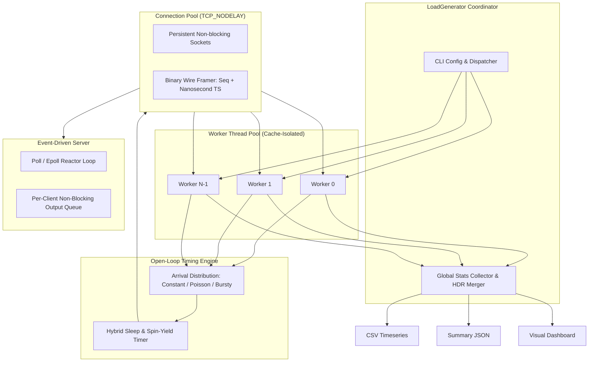
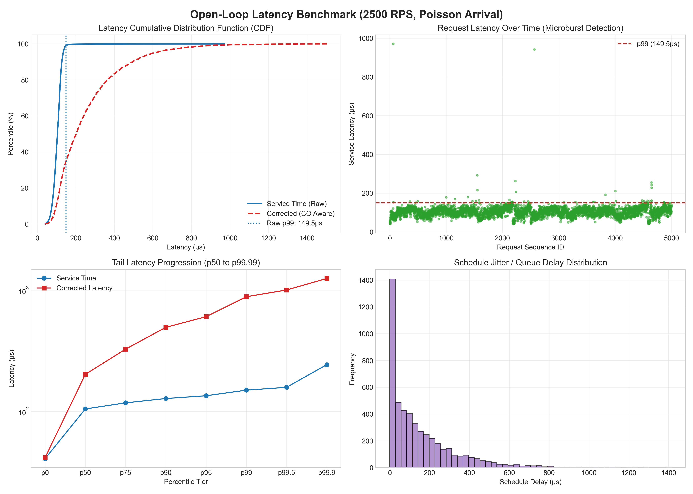

# Low-Latency Load Generator & Performance Engine

[](https://github.com/nitinredddy/Low-Latency-Load-Generator/actions/workflows/ci.yml)
[](https://en.cppreference.com/w/cpp/17)
[]()
[]()

A high-performance, open-loop TCP benchmarking engine and event-driven echo server designed for sub-millisecond network measurement, queueing analysis, and tail-latency profiling in C++17.

---

## Table of Contents
- [Motivation & Problem Statement](#motivation--problem-statement)
- [System Architecture](#system-architecture)
- [Key Engineering Features](#key-engineering-features)
- [Arrival Distributions & Queueing Theory](#arrival-distributions--queueing-theory)
- [Coordinated Omission Awareness](#coordinated-omission-awareness)
- [Wire Protocol Specification](#wire-protocol-specification)
- [Build Instructions](#build-instructions)
- [Usage & Quick Start](#usage--quick-start)
- [Analysis & Visualization](#analysis--visualization)
- [Testing & Quality Assurance](#testing--quality-assurance)

---

## Motivation & Problem Statement

Benchmarking low-latency networked systems requires extreme precision and rigorous queueing discipline:

1. **Closed-Loop vs. Open-Loop**: Traditional tools (like `ab` or synchronous request loops) are closed-loop: they send a request and wait for a response before dispatching the next. If the server pauses (e.g. GC, lock contention, packet loss), closed-loop generators back off and send *fewer* requests—artificially hiding latency spikes.
2. **Coordinated Omission**: Coined by Gil Tene, coordinated omission occurs when delays in request execution cause subsequent scheduled requests to back up, corrupting percentile calculations.
3. **Timer Jitter**: Standard OS timers (`sleep_for`, `sleep_until`) have typical wake-up jitter between 50µs and 250µs. Precise rate generation requires hybrid spin-wait mechanisms to hit microsecond target intervals.

This project implements an open-loop, multi-threaded generator that models realistic Poisson traffic arrivals, tracks both service time and schedule delays, and computes sub-microsecond latency percentiles with zero dynamic allocation overhead on the hot path.

---

## System Architecture



---

## Key Engineering Features

- **Multi-Threaded Work Partitioning**: Distributes request schedules across independent worker threads with private per-thread connection pools and zero lock contention during load generation.
- **Connection Pooling**: Supports multiple concurrent TCP connections per worker thread (`--connections C --threads T`) to stress concurrent server handling.
- **Sub-Microsecond Hybrid Scheduling**: Combines kernel sleeping with fine-grained CPU pause/yield spinloops to eliminate OS timer jitter at high rates (> 10,000 RPS).
- **Logarithmic HDR Histogram**: Fixed-memory, multi-decade histogram (`0.1 µs` to `10 s`) supporting high-precision tail percentiles (`p50`, `p75`, `p90`, `p95`, `p99`, `p99.9`, `p99.99`, `min`, `max`, `stddev`).
- **Binary Wire Protocol**: Lightweight 28-byte packet header embedding sequence numbers, nanosecond client timestamps, and checksums to verify payload integrity and detect corrupt or out-of-order packets.
- **Event-Driven Non-Blocking Server**: Single-threaded reactor using `poll()` with non-blocking I/O, per-socket output queueing, and TCP_NODELAY optimization.
- **Warmup Discarding**: Excludes initial warmup requests (`--warmup N`) to eliminate TCP slow-start and cache cold-start artifacts.

---

## Arrival Distributions & Queueing Theory

Real-world network traffic does not arrive at perfectly spaced intervals. The generator provides three arrival models:

| Distribution | Theory & Formula | Use Case |
|---|---|---|
| **Constant** | $\Delta t = \frac{1}{\lambda}$ | Idealized synthetic baseline |
| **Poisson / Exponential** | Memoryless Poisson process: $f(t) = \lambda e^{-\lambda t}$ | Realistic network traffic (M/M/1 queueing model) |
| **Bursty** | Bimodal distribution with periodic microburst bursts | Modeling packet bunching and sudden traffic spikes |

---

## Coordinated Omission Awareness

When target arrival rate is $\lambda$, request $i$ has an intended target time:
$$T_{\text{scheduled}}(i) = T_0 + \sum_{k=0}^{i-1} \Delta t_k$$

If request $i-1$ is delayed, request $i$ may not be sent until $T_{\text{sent}}(i) > T_{\text{scheduled}}(i)$.

The load generator records:
- **Service Time**: $T_{\text{recv}} - T_{\text{sent}}$ (what conventional benchmarks report)
- **Schedule Delay (Queue Jitter)**: $\max(0, T_{\text{sent}} - T_{\text{scheduled}})$
- **Corrected Latency**: $T_{\text{recv}} - T_{\text{scheduled}}$ (the actual latency experienced by a client waiting for the system)

---

## Wire Protocol Specification

Framed binary mode (`--use_binary_protocol`, default) wraps payloads with a 28-byte header:

```text
 0                   1                   2                   3
 0 1 2 3 4 5 6 7 8 9 0 1 2 3 4 5 6 7 8 9 0 1 2 3 4 5 6 7 8 9 0 1
+-+-+-+-+-+-+-+-+-+-+-+-+-+-+-+-+-+-+-+-+-+-+-+-+-+-+-+-+-+-+-+-+
|  Magic (0x5A) |  Version (1)  |     Flags     |   Reserved    |
+-+-+-+-+-+-+-+-+-+-+-+-+-+-+-+-+-+-+-+-+-+-+-+-+-+-+-+-+-+-+-+-+
|                      Sequence ID (64-bit)                     |
|                                                               |
+-+-+-+-+-+-+-+-+-+-+-+-+-+-+-+-+-+-+-+-+-+-+-+-+-+-+-+-+-+-+-+-+
|                 Client Timestamp (Nanoseconds)                |
|                                                               |
+-+-+-+-+-+-+-+-+-+-+-+-+-+-+-+-+-+-+-+-+-+-+-+-+-+-+-+-+-+-+-+-+
|                      Payload Length (32-bit)                  |
+-+-+-+-+-+-+-+-+-+-+-+-+-+-+-+-+-+-+-+-+-+-+-+-+-+-+-+-+-+-+-+-+
|                      CRC / Checksum (32-bit)                  |
+-+-+-+-+-+-+-+-+-+-+-+-+-+-+-+-+-+-+-+-+-+-+-+-+-+-+-+-+-+-+-+-+
|                        Payload Data...                        |
+-+-+-+-+-+-+-+-+-+-+-+-+-+-+-+-+-+-+-+-+-+-+-+-+-+-+-+-+-+-+-+-+
```

A raw byte mode (`--raw`) is also provided for benchmarking standard echo servers.

---

## Build Instructions

### Prerequisites
- C++17 compliant compiler (`g++` >= 8, `clang++` >= 9, or AppleClang)
- CMake >= 3.16
- Python 3.8+ (for integration tests and visualization)

### Compiling
```bash
cmake -S . -B build -DCMAKE_BUILD_TYPE=Release
cmake --build build -j
```

---

## Usage & Quick Start

### 1. Launch the Server
```bash
./build/echo_server --port 9000
```

### 2. Run a Multi-Threaded Poisson Benchmark
```bash
./build/load_generator \
  --host 127.0.0.1 \
  --port 9000 \
  --requests 10000 \
  --rate 5000 \
  --threads 4 \
  --connections 8 \
  --distribution poisson \
  --payload 128 \
  --output benchmarks/results.csv \
  --json benchmarks/results.json
```

### Sample Output
```text
===================================================================
        LOW-LATENCY LOAD GENERATOR (C++17 Open-Loop Engine)        
===================================================================
 Target:         127.0.0.1:9000
 Planned Load:   10000 requests @ 5000 RPS
 Workers:        4 thread(s) with 8 total connection(s)
 Arrival Model:  poisson
 Payload:        128 bytes per request
 Socket Options: TCP_NODELAY=ON
 Protocol:       Binary Framed (Timestamped)
===================================================================

[*] Establishing 8 TCP connection(s) to 127.0.0.1:9000 across 4 thread(s)...
[*] Benchmark started. Dispatching 10000 requests at 5000 target RPS (poisson distribution)...

======================== BENCHMARK RESULTS ========================
 Total Scheduled:   10000
 Completed:         10000 (Warmup discarded: 0)
 Errors:            0
 Elapsed Time:      2.01 s
 Actual Throughput: 4975.12 req/s (5.09 Mbit/s)
-------------------------------------------------------------------
 Latency Percentiles (Service Time: Send -> Recv):
   Min:                  38.20 us (0.04 ms)
   p50 (Median):         96.40 us (0.10 ms)
   p75:                 108.15 us (0.11 ms)
   p90:                 119.50 us (0.12 ms)
   p95:                 127.20 us (0.13 ms)
   p99:                 142.80 us (0.14 ms)
   p99.9:               230.10 us (0.23 ms)
   Max:                 890.40 us (0.89 ms)
   Mean:                 98.22 us
   Std Dev:              24.18 us
===================================================================
```

---

## Analysis & Visualization

Run the automated analysis and plotting script to generate performance charts:

```bash
python3 scripts/analyze_results.py benchmarks/results.csv --plot docs/assets/latency_dashboard.png
```

This generates a 4-quadrant latency dashboard:
1. **Latency CDF**: Empirical cumulative distribution function comparing raw service time vs. corrected latency.
2. **Timeline Scatter**: Microburst and outlier detection over time.
3. **Tail Latency Progression**: Log-scale percentile curve from $p50$ through $p99.99$.
4. **Schedule Jitter**: Histogram of queue delays and dispatch jitter.



---

## CLI Options Reference

### `load_generator`

| Option | Type | Default | Description |
|---|---|---|---|
| `--host` | `string` | `127.0.0.1` | Target server hostname or IP |
| `--port` | `int` | `9000` | Target server port |
| `--requests` | `int` | `1000` | Total number of requests |
| `--rate` | `double` | `1000.0` | Target requests per second |
| `--threads`, `-t` | `int` | `1` | Number of worker threads |
| `--connections`, `-c` | `int` | `threads` | Total concurrent TCP connections |
| `--payload` | `int` | `64` | Payload size in bytes |
| `--distribution`, `-d`| `string` | `constant` | Arrival model: `constant`, `poisson`, `burst` |
| `--warmup` | `int` | `0` | Requests excluded from measurement |
| `--raw` | `flag` | `false` | Disable binary headers; send raw bytes |
| `--output`, `-o` | `string` | `""` | Path to export per-request CSV timeseries |
| `--json` | `string` | `""` | Path to export summary metrics JSON |
| `--nodelay` | `0 \| 1` | `1` | Enable/disable `TCP_NODELAY` |
| `--timeout` | `int` | `5000` | Socket timeout in milliseconds |

### `echo_server`

| Option | Type | Default | Description |
|---|---|---|---|
| `--port` | `int` | `9000` | Port to listen on |
| `--bind` | `string` | `127.0.0.1` | Network interface to bind |
| `--backlog` | `int` | `1024` | Listen socket backlog |
| `--buffer-size` | `int` | `64` | Socket buffer size in KB |
| `--nodelay` | `0 \| 1` | `1` | Enable/disable `TCP_NODELAY` |

---

## Testing & Quality Assurance

The project includes unit tests for core algorithms and Python integration suites:

```bash
# Run CTest suite (C++ unit tests + smoke test)
ctest --test-dir build --output-on-failure

# Run comprehensive pytest integration suite
pytest -v tests/test_benchmark_suite.py
```

### Test Coverage
- **`unit_histogram`**: Validates logarithmic binning, percentile accuracy ($p50$ through $p99.9$), and multi-threaded histogram merging.
- **`unit_protocol`**: Validates packet serialization, header checksums, and corruption detection.
- **`pytest` Suite**: Tests concurrency, connection pooling, Poisson scheduling, CSV/JSON export integrity, and warmup discards.

---

## License

MIT License. Designed and engineered for systems programming education and low-latency network benchmarking.
